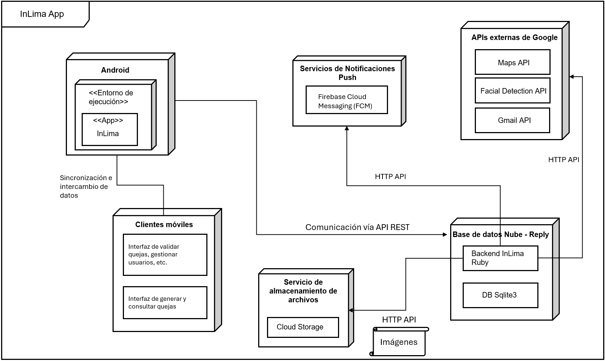
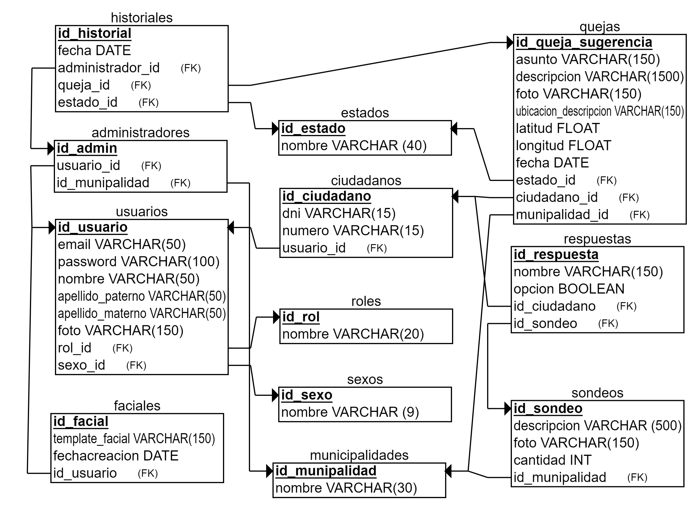
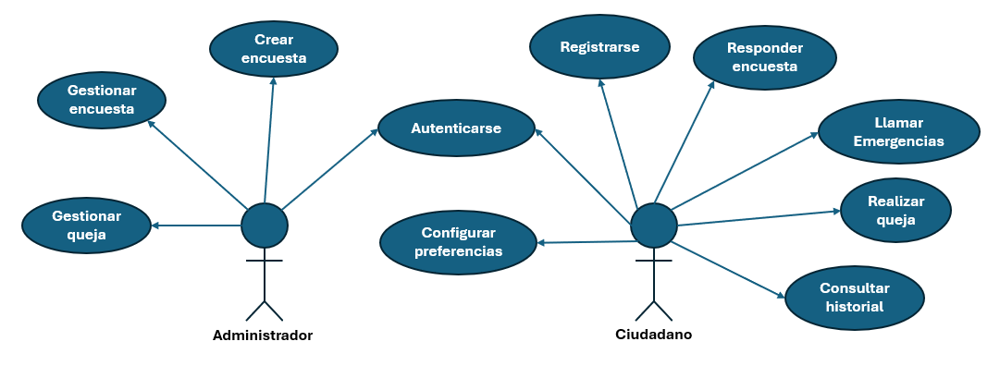
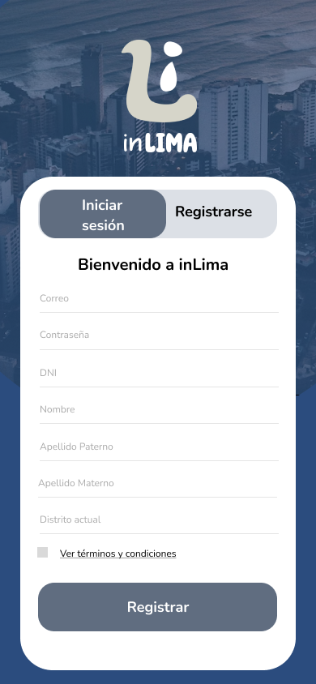
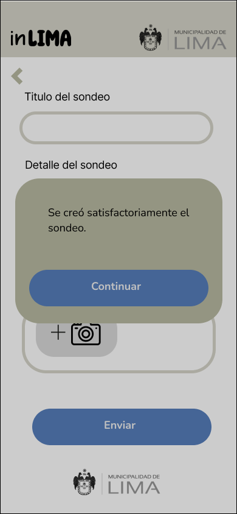
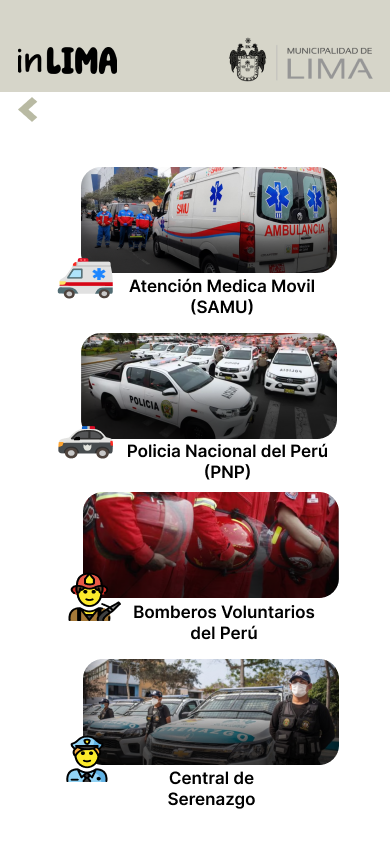
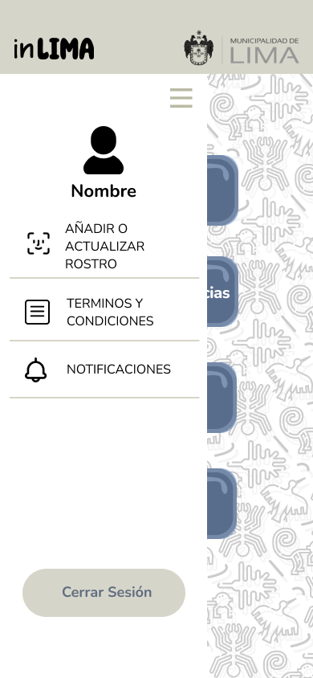
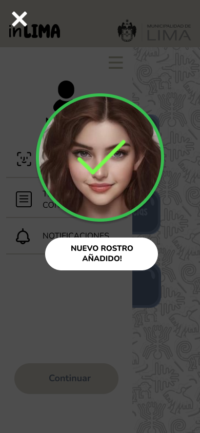

# InLima - Grupo 4 🚀
La aplicación de InLima permite a los usuarios generar reportes de problemas en su entorno urbano, como incidentes, quejas y solicitudes de mejora. Los reportes incluyen descripciones detalladas, ubicaciones (gracias a la integración con la 🗺️API de Google Maps) y la posibilidad de adjuntar fotos como evidencia.

Los administradores pueden gestionar estos reportes, atendiendo las quejas por distrito, modificando el estado de los incidentes, y notificando automáticamente a los usuarios sobre los cambios a través de la 📧 API de Gmail.


InLima también ofrece una funcionalidad de sondeos 📊, donde los usuarios pueden votar 👍👎 en encuestas sobre proyectos urbanos, ayudando a las autoridades locales a tomar decisiones basadas en la opinión pública. Los administradores pueden crear 📝 y gestionar encuestas, consultando los resultados 📈 para una toma de decisiones más participativa.

# Guía de Desarrollo para la Aplicación **InLima**

### 🚀 Breve Descripción del Entorno de Desarrollo 💻

El entorno de desarrollo para la aplicación **InLima** está construido sobre **Flutter**, una tecnología de desarrollo multiplataforma que permite crear aplicaciones móviles de alto rendimiento para **iOS** y **Android**. Además, **Android Studio** se utiliza para gestionar emuladores, entornos de desarrollo y los SDKs necesarios para la ejecución en dispositivos **Android**.

> **Flutter**: [Sitio oficial de Flutter](https://flutter.dev)  
> **Android Studio**: [Sitio oficial de Android Studio](https://developer.android.com/studio)

---

### 📥 Descarga e Instalación del SDK de Flutter

Para comenzar con Flutter, sigue estos pasos:

1. Visita el sitio oficial de **Flutter** en [flutter.dev](https://flutter.dev) y descarga el archivo ZIP del SDK correspondiente a tu sistema operativo.
2. Descomprime el archivo en una ubicación sin espacios o caracteres especiales en la ruta.
   - **Ejemplo de ruta recomendada**: `C:\flutter\` o `/usr/local/flutter/`.

⚠️ **Importante**: Evita descomprimir Flutter en directorios como `C:\Program Files\` debido a posibles restricciones de permisos.

---

### 🛠️ Configuración de Variables de Entorno

Después de instalar Flutter, es necesario configurar las variables de entorno para que el sistema pueda reconocer los comandos de **Flutter**.

1. Abre las **Propiedades del Sistema**:
   - Ve a **Panel de control** > **Sistema y seguridad** > **Sistema** > **Configuración avanzada del sistema**.
2. En la ventana emergente, selecciona **Variables de entorno**.
3. Dentro de **Variables del sistema**, localiza la variable **Path** y selecciona **Editar**.
4. Agrega una nueva entrada con la ruta completa hacia la carpeta `flutter/bin` (donde descomprimiste Flutter).
   - **Ejemplo**: `C:\flutter\bin\` o `/usr/local/flutter/bin`.

💡 **Consejo**: Asegúrate de que el comando `flutter` esté disponible en tu terminal ejecutando `flutter --version`.

---

### ✅ Verificación de la Instalación de Flutter

Para asegurarte de que todo está configurado correctamente:

1. Abre una ventana de **Símbolo del sistema**, **PowerShell** o una terminal en tu sistema operativo.
2. Ejecuta el siguiente comando:

   ```bash
   flutter doctor

## Diagrama de despliegue 🌐


## Requerimientos no funcionales 📋
## RENDIMIENTO
#### RNF1 - Rendimiento de Carga de Interfaces
- **Prioridad:** Alta
- **Descripción:** Las interfaces principales deben cargar en menos de 3 segundos cuando se accede a través de una conexión 3G o superior. Esto es esencial para garantizar una buena experiencia de usuario, especialmente en condiciones de red más lentas.

#### RNF2 - Soporte de Usuarios Simultáneos
- **Prioridad:** Alta
- **Descripción:** El sistema debe ser capaz de manejar al menos 100 usuarios simultáneos sin experimentar pérdidas de rendimiento significativas. Esto asegura que el servicio se mantenga operativo y rápido bajo cargas normales.

#### RNF3 - Latencia de Comunicación con APIs Externas
- **Prioridad:** Media
- **Descripción:** La latencia de las comunicaciones con servicios externos como Google, Firebase o Cloud Storage debe ser inferior a 500 ms. Un tiempo de respuesta rápido es crucial para evitar demoras en el uso de la aplicación.

## SEGURIDAD
#### RNF4 - Cifrado de Datos en Reposo y en Tránsito
- **Prioridad:** Alta
- **Descripción:** Los datos deben estar cifrados tanto en reposo como en tránsito utilizando HTTPS y AES de 256 bits. Esto garantiza que la información sensible esté protegida frente a accesos no autorizados.

#### RNF5 - Comunicación Segura entre Servicios
- **Prioridad:** Alta
- **Descripción:** La comunicación entre todos los servicios debe realizarse mediante protocolos seguros como TLS/SSL, y cualquier archivo adjunto debe estar cifrado para asegurar su confidencialidad.


## Disponibilidad

#### RNF6 - Disponibilidad del Sistema
- **Prioridad:** Alta
- **Descripción:** El sistema debe tener una disponibilidad del 99.5% del tiempo anual, lo que significa que solo se permite un máximo de 24 horas de inactividad por año. Esto garantiza que el sistema esté disponible para los usuarios la mayor parte del tiempo.

#### RNF7 - Tiempo Máximo de Inactividad Permitido
- **Prioridad:** Media
- **Descripción:** El tiempo máximo de inactividad permitido es de 24 horas por año. Esto asegura que los tiempos de mantenimiento o fallos no impacten gravemente la experiencia del usuario.

#### RNF8 - Plan de Contingencia para Fallos Externos
- **Prioridad:** Media
- **Descripción:** Se debe contar con un plan de contingencia que garantice la continuidad del servicio en caso de fallos en servicios externos como APIs, Firebase o Cloud Storage, minimizando así el impacto en los usuarios.

## Escalabilidad
#### RNF9 - Escalabilidad de Usuarios Simultáneos
- **Prioridad:** Alta
- **Descripción:** El sistema debe ser capaz de escalar hasta 400 usuarios simultáneos sin comprometer el rendimiento, asegurando la capacidad de soportar el crecimiento en el número de usuarios.

#### RNF10 - Escalabilidad de Funcionalidades
- **Prioridad:** Media
- **Descripción:** El sistema debe permitir la integración de nuevas funcionalidades o servicios externos sin requerir una reescritura significativa del código, lo que garantiza una evolución continua del sistema sin grandes interrupciones.

#### RNF11 - Manejo de Cargas Mayores de Notificaciones y Almacenamiento
- **Prioridad:** Media
- **Descripción:** El sistema debe estar preparado para manejar un aumento en la cantidad de notificaciones y almacenamiento de datos sin afectar negativamente el rendimiento, especialmente en picos de uso.

## Usabilidad

#### RNF12 - Usabilidad e Interfaz Intuitiva
- **Prioridad:** Alta
- **Descripción:** La interfaz debe ser intuitiva y accesible, cumpliendo con las pautas WCAG 2.1, e incluir retroalimentación visual y auditiva para garantizar la mejor experiencia para todos los niveles de usuarios.

#### RNF13 - Formularios y Botones Claros
- **Prioridad:** Media
- **Descripción:** Los formularios y botones deben estar diseñados de manera clara y comprensible, con el fin de que los usuarios de todos los niveles puedan utilizarlos sin dificultades.

## Compatibilidad

#### RNF14 - Compatibilidad con Dispositivos y APIs
- **Prioridad:** Media
- **Descripción:** El sistema debe ser compatible con las últimas versiones de Android y adaptarse a distintos tamaños de pantalla, así como ser capaz de soportar actualizaciones menores de APIs de Google (Maps, Facial Detection, Gmail).

#### RNF15 - Interfaz Responsiva
- **Prioridad:** Media
- **Descripción:** La interfaz debe ser completamente responsiva, adaptándose de manera efectiva a múltiples dispositivos, ya sean móviles, tabletas o computadoras, para asegurar una experiencia fluida en cualquier entorno.


## Diagrama relacional


## Diagrama de casos de uso 🛠️


## Descripción de casos de uso 📝

### 1. Registro de Usuario
- **RF1:** El sistema debe permitir al ciudadano registrarse proporcionando correo, contraseña, DNI, nombre, apellidos y distrito actual.




### 2. Autenticación de Usuario
- **RF2:** El sistema debe permitir al usuario iniciar sesión validando el correo y la contraseña proporcionados con los datos de la base de datos.


- **RF3:** El sistema debe permitir al usuario iniciar sesión utilizando identificación facial.


- **RF4:** El sistema debe proporcionar una opción de recuperación de contraseña. Al hacer clic en "Olvidé mi contraseña", el usuario debe poder ingresar su correo electrónico para recibir un enlace de restablecimiento de contraseña.


### 3. Acceso al Menú Principal
- **RF5:** El sistema debe llevar al usuario al **menú principal** después de iniciar sesión, donde podrá acceder a las siguientes opciones:
   - **SOS:** Acceso rápido a servicios de emergencia (en caso sea ciudadano).
   - **Quejas/Sugerencias:** Permite generar y gestionar quejas.
   - **Sondeos:** Acceso a encuestas y votaciones.
   - **Historial:** Acceso al historial de quejas propio del usuario (en caso sea ciudadano).
 


### 4. Gestión de Quejas y Sugerencias
- **RF6:** El sistema debe permitir al ciudadano seleccionar el tipo de queja o sugerencia desde una lista de opciones predefinidas o la opción 'Otros'.


- **RF7:** El sistema debe permitir al ciudadano detallar el problema o sugerencia relacionado con el tipo seleccionado.


- **RF8:** El sistema debe mostrar al ciudadano el historial de quejas previas enviadas, incluyendo detalles como una imagen asociada.


- **RF9:** El sistema debe permitir al administrador revisar una lista de quejas o sugerencias recibidas, clasificadas por tipo de queja.


- **RF10:** El sistema debe permitir al administrador modificar el estado de las quejas.


### 5. Gestión de Encuestas y Votaciones
- **RF11:** El sistema debe mostrar al ciudadano una lista de proyectos disponibles para votar, acompañados de imágenes y descripciones.


- **RF12:** El sistema debe permitir al ciudadano votar a favor o en contra de los proyectos mediante botones de "De acuerdo" o "Desacuerdo".

 

- **RF13:** El sistema debe permitir al administrador crear encuestas ingresando el título y el detalle o descripción del sondeo.

 
 
- **RF14:** El sistema debe permitir al administrador consultar los resultados de las encuestas.

 

### 6. Acceso a Servicios de Emergencia
- **RF15:** El sistema debe permitir al ciudadano visualizar una lista de servicios de emergencia disponibles, como SAMU, PNP, Bomberos y Central de Serenazgo.



### 7. Configuración y Preferencias del Usuario

- **RF16:** El sistema debe permitir al usuario acceder a una barra lateral con diferentes opciones de configuración después de iniciar sesión. El usuario podrá desplegar esta barra lateral desde el ícono de menú y acceder a las opciones de "Añadir o actualizar rostro", "Términos y condiciones", "Notificaciones" y "Cerrar sesión".



- **RF17:** El sistema debe permitir al ciudadano activar o desactivar las notificaciones push desde la configuración.


- **RF18:** El sistema debe mostrar el nombre del usuario y permitirle agregar o actualizar su rostro para el inicio de sesión con identificación facial.

 
 
 

- **RF19:** El sistema debe permitir al ciudadano visualizar y gestionar los "Términos y condiciones".


- **RF20:** El sistema debe permitir al ciudadano cerrar sesión desde la pantalla de ajustes.


## Integrantes 👥

- Marcelo Cabrejos Benites (20200333)
- Renzo Tipula Cochachin (20202084)
- Roberto Lopez Jauregui (20201192)
- Arturo Silvera Pocco (20204965)
- Rafael Calderon la Rosa (20200349)

## License

This project is open-source and free to use under the [MIT License](LICENSE).
